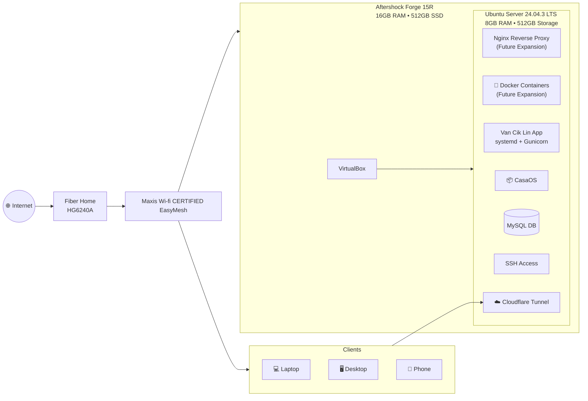

# Homelab

## Overview
Personal homelab built for learning Linux, virtualization and secure application deployments

## Phase 1: Laptop-based
A laptop is a good device for me as a beginner to experiment with homelab. It is low-cost and low-risk to experiment with:
- Linux server
- Web application deployement
- Remote access
- Databases

So I started exploring Linux for hosting my app using this setup. It was also a part of my homelab testing:

### Architecture

### Laptop Specs

Model: Level51 Forge 15R

CPU: AMD Ryzen 5 3600 (6 cores / 12 threads, up to 4.2 GHz)

RAM: 16 GB DDR4

OS (Host): Windows 11

### Virtualization
Virtualizer: VirtualBox

Allocated vCPU: 4cores

Allocated RAM: 8GB

Allocated Storage: 512GB Virtual Disk

### Guest VM (Server)
OS: Ubuntu Server 24.04 LTS
Services:
- SSH for server remote access
- Flask app for testing web application
- Gunicorn - WSGI server for Python web apps
- MYSQL - database backend
- Cloudflared Tunnel for secure remote access without port forwarding
- Custom domain (Hostinger). I used the cheapest one that connected via Cloudflared Tunnel.
- CasaOS used to easily manage files and transfer my Flask app into the server

## Phase 2: Homelab Upgrade with Mini PC
I upgraded my homelab from a laptop to a Lenovo ThinkCentre M900 Tiny with Proxmox installed.

### Specs
- Mini pc: Lenovo ThinkCentre Tiny M900
- Storage: 512GB
- Memory: 8GB
- Processor: Intel i5-6500T (4 cores, 4 threads)

## What This Homelab Demonstrates
- Linux server administration
- Virtualization using VirtualBox
- Secure remote access via Cloudflare Tunnel
- Web application deployment (Flask + Gunicorn)
- Reverse proxy architecture (Nginx)
- Database hosting (MySQL)

## What I Have Learned From This Homelab
- Understanding reverse proxy architecture
- Managing Linux services using systemd
- Debugging deployment issues
- Secure exposure of services without port forwarding
- VM resource allocation and performance considerations

## Roadmap

- [x] Build DIY rack-mounted setup
- [ ] Add managed switch and VLAN segmentation
- [ ] Patch panel installation
- [ ] Structured cable management
- [ ] Docker containerization
- [ ] Monitoring stack (Zabbix / Grafana)
