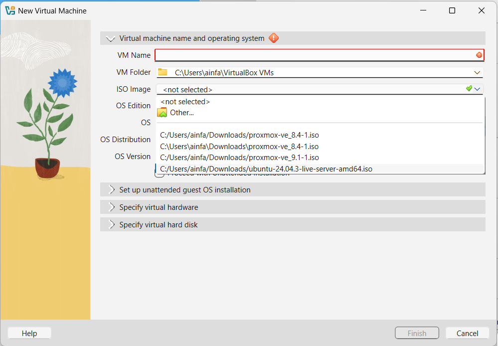
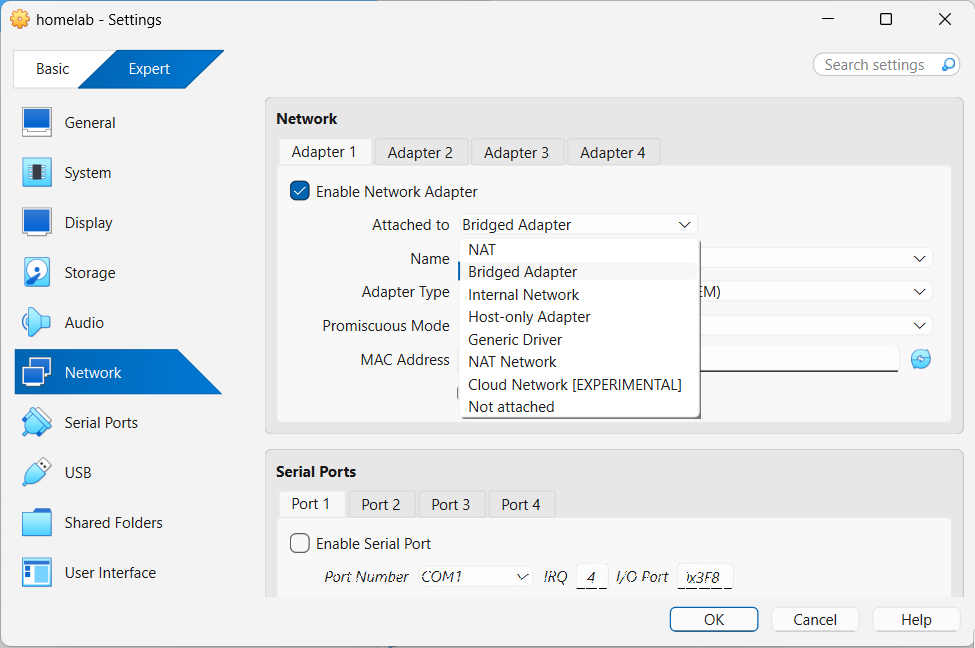
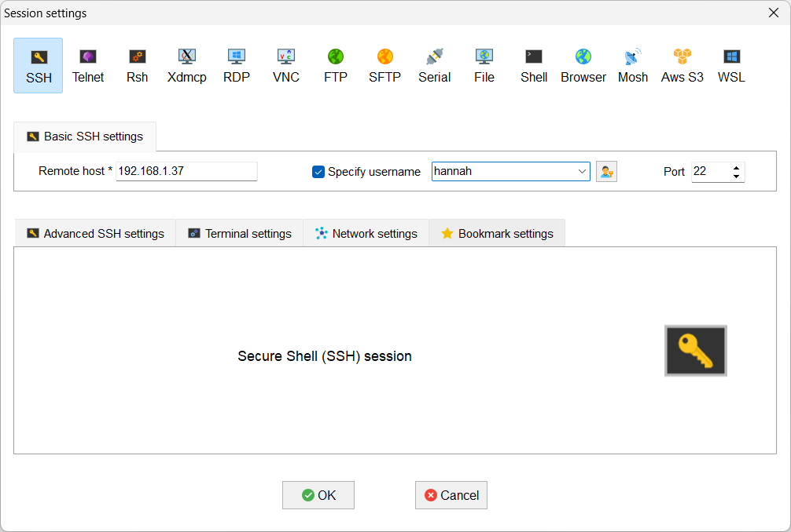
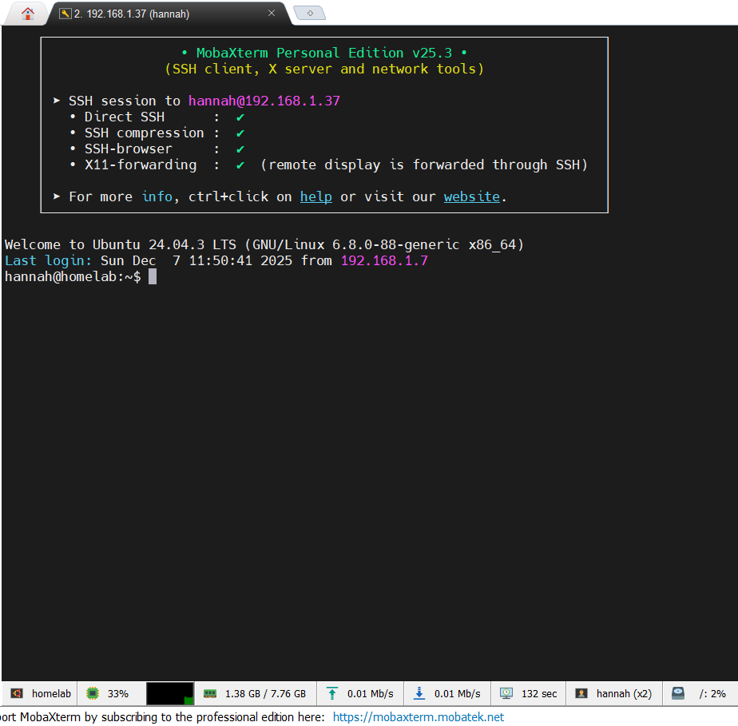

# Install Ubuntu 24.04.3 LTS on VirtualBox

I used VirtualBox to run Ubuntu Server 24.04.3 LTS as a testing of homelab. 

## Install VirtualBox

Download and install VirtualBox

VirtualBox installer: https://www.virtualbox.org/wiki/Downloads

## Install Ubuntu Server 24.04.3 LTS

Download and install Ubuntu Server 24.04.3 LTS on VirtualBox

Ubuntu Server 24.04.3 LTS installer: https://ubuntu.com/download/server

## Configure Ubuntu Server 24.04.3 LTS
Create new virtual machine and choose Ubuntu Server 24.04.3 LTS as the operating system.

Make sure the network attached to Bridge Adapter.

## Use MobaXterm to connect to the virtual machine

Download and install MobaXterm

MobaXterm installer: https://mobaxterm.mobatek.net/download.html

Connect to the virtual machine using MobaXterm

MobaXterm will connect to the virtual machine and you will be able to see the terminal.

