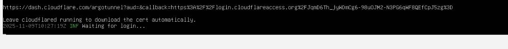
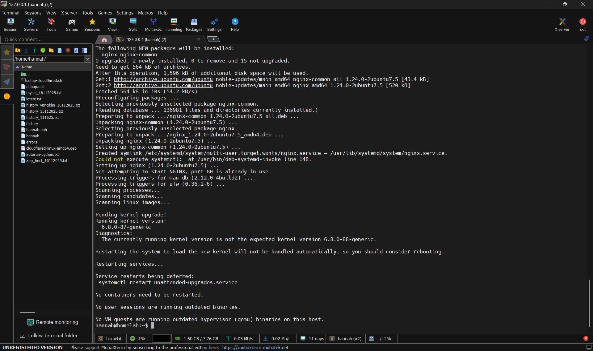

# Cloudflared Tunnel Setup
Add GPG key and install cloudflared via apt
```bash
sudo apt install curl
sudo curl -fsSL https://pkgs.cloudflared.com/cloudflared-debian.deb.txt | sudo tee /etc/apt/trusted.gpg.d/cloudflared.gpg
sudo apt install cloudflared
```

Install .deb package manually
```bash
sudo apt install ./cloudflared-linux-amd64.deb
```
Verify the installation
```bash
cloudflared --version
```
First successful service check
```bash
sudo systemctl status cloudflared
```
## Create a tunnel for SSH connection
I created a tunnel for SSH connection to the server, so I can connect to the server anywhere remotely

Login to Cloudflare
```bash
cloudflared login
```


Create a tunnel for SSH
```bash
cloudflared tunnel create homelab
```
Create a configuration file for the tunnel  
```bash
sudo nano /etc/cloudflared/config.yml
```
```yaml
tunnel: <TUNNEL-UUID> # only if using a named tunnel
credentials-file: /etc/cloudflared/<TUNNEL-UUID>.json

ingress:
  - hostname: ssh.hanaxxiv-server.site
    service: tcp://127.0.0.1:2222
  - service: http_status:404
```

Successfully routed DNS for tunnel
```bash
cloudflared tunnel route dns homelab ssh.hanaxxiv-server.site
```


Using other device, I ran this command to connect to the server
```bash
cloudflared access tcp --hostname ssh.hanaxxiv-server.site --url 127.0.0.1:2222
```

Then, I can connect to the server using MobaXterm by using 
```127.0.0.1``` and ```2222``` as the port.



I accessed my server outside the network depended on both SSH + tunnel