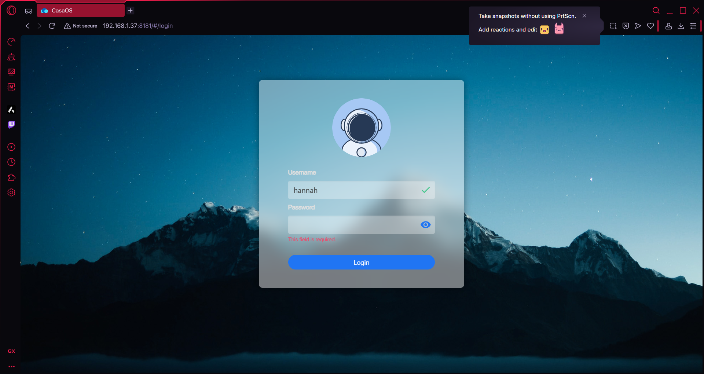

# Docker and CasaOs Installation
Since it's my first setting up this server, I chose CasaOS for first exposer.

I also experience an issue installing the CasaOS, where it failed to load app.

So I followed this instruction to solve the issue:

https://github.com/IceWhaleTech/CasaOS/issues/2404

The issue was solved and I can register and login the account

