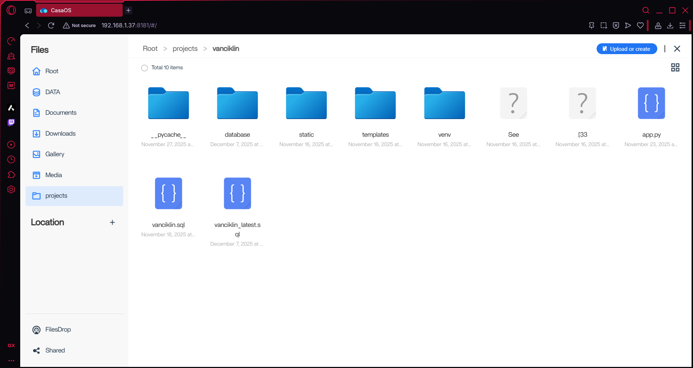
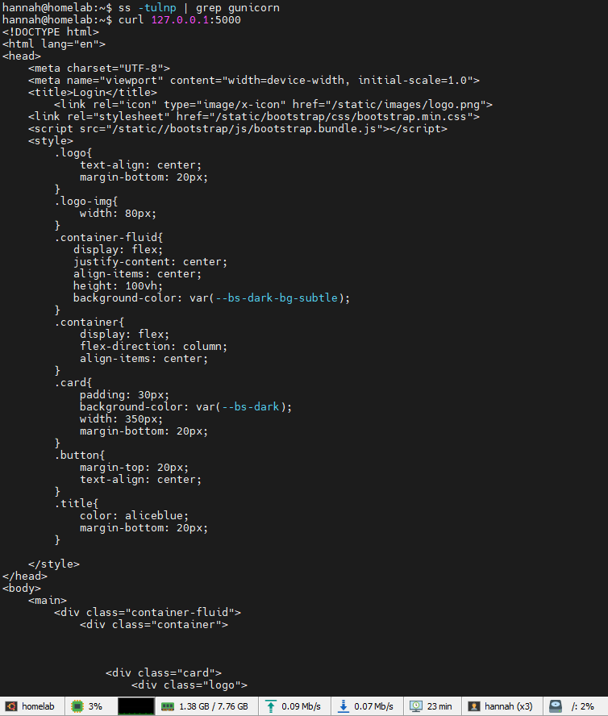

# Python, MySQL and Flask app configuration

To host my Flask app, I did install Python first

Installed Python venv, build tools, and MySQL server
```bash
sudo apt install python3-pip python3-venv -y
sudo apt install python3-dev default-libmysqlclient-dev build-essential -y
sudo apt update
sudo apt install mysql-server libmysqlclient-dev python3-dev build-essential -y
```

Install MySQL
```bash
sudo apt install mysql
```

Install mysqlclient
```bash
sudo apt install pkg-config libmysqlclient-dev -y
```

Create folder using CasaOs and transfer my Flask app files on it




Fixed folder permissions for my project
```bash
cd /projects/vanciklin
sudo chown -R hannah:hannah /projects/vanciklin
```

Create and activate the virtual environment
```bash
python3 -m venv venv
source venv/bin/activate
```

Since I didn't include the ```requirements.txt``` I installed the packages manually

```python
pip install Flask
pip install flask-mysqldb
```

Waesyprint package and configuration. I used Weasyprint package for Flask app to generate pdf

```python
pip install Weasyprint
```
Installed system libraries for PDF generation (weasyprint)
```bash
apt install python3-pip libpango-1.0-0 libharfbuzz0b libpangoft2-1.0-0 libharfbuzz-subset0
```
I also installed gunicorn
```python
pip install gunicorn
```

Opened port for my Flask app
```bash
sudo ufw allow 5000/tcp
sudo ufw reload
```
Ran the app on python environment
```python
export FLASK_APP=app.py       # if not already set
export FLASK_ENV=development  # optional for debug
flask run --host=0.0.0.0 --port=5000
```
Create systemd for service file
```bash
sudo cloudflared service install
sudo nano /etc/systemd/system/vanciklin.service
```

```ini
[Unit]
Description=Van Cik Lin Flask Application
After=network.target

[Service]
User=www-data
Group=www-data
WorkingDirectory=/var/www/vanciklin
Environment="PATH=/var/www/vanciklin/venv/bin"
ExecStart=/var/www/vanciklin/venv/bin/gunicorn --workers 3 --bind 127.0.0.1:5000 app:app

Restart=always
RestartSec=5

[Install]
WantedBy=multi-user.target
```
Enabled it as a background service
```bash
sudo systemctl daemon-reload
sudo systemctl enable vanciklin.service
sudo systemctl start vanciklin.service
```
Confirmed the app is responding locally
```bash

curl http://127.0.0.1:500
```



Test with browser with server ip and port ```192.168.1.37:5000```


MySQL database configuration
....

