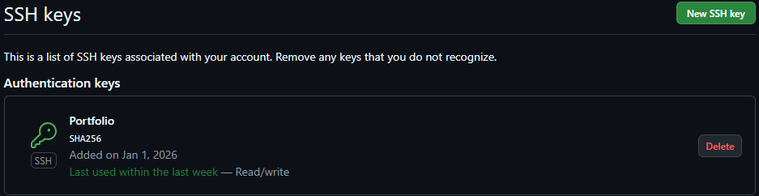
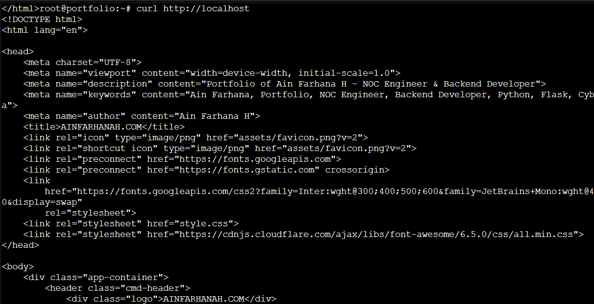
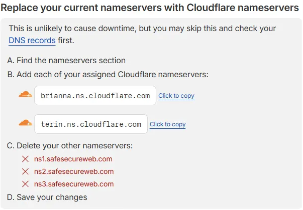
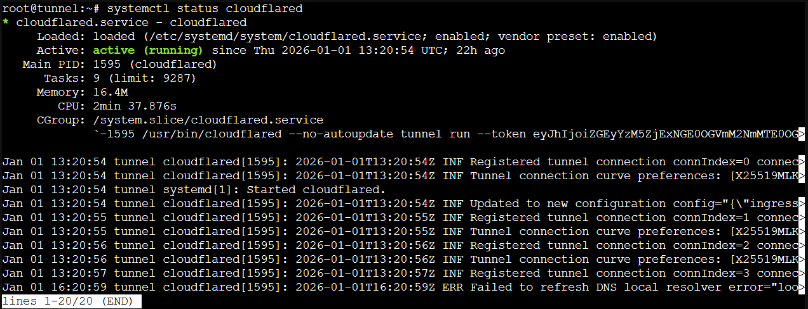
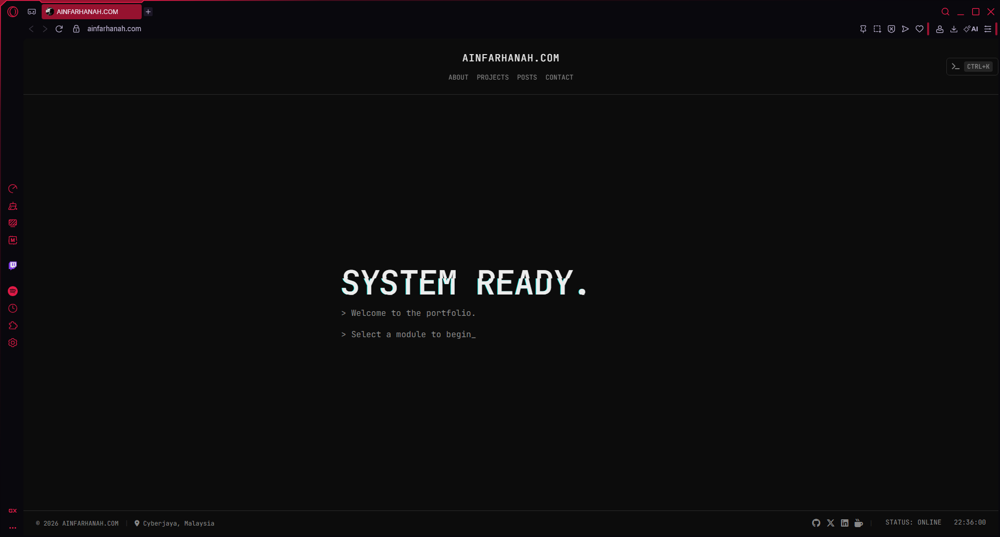

# Hosting My Portfolio Website Using a Simple Homelab Setup
I created a private repository for my portfolio website. I plan to publish it on the internet using a very basic homelab server — not a bangsawan or kayangan setup, just enough to meet my objective of hosting my apps and services.

To start, I created an LXC container dedicated to my portfolio website. Since the repository is private, I first generated an SSH key to securely connect the container to my GitHub account.

### Creating an SSH Key from My Homelab

```bash
ssh-keygen -t ed25519 -C "portfolio
```

Display the public key:

```bash 
cat ~/.ssh/id_ed25519.pub
```


Add this public key to your GitHub account under SSH and GPG keys.

### Test GitHub SSH Access
```bash
ssh -T git@github.com
```

### Installing Git and Cloning the Repository

Install Git:
```bash
apt install git
```

Create a directory for web files and adjust permissions:

```bash
sudo mkdir -p /var/www
sudo chown $USER:$USER /var/www
cd /var/www
```

Clone the private repository:

```bash
git clone git@github.com:username/portfolio.git
```

Verify the files:

```bash
ls -la
```

### Serving the Portfolio with Nginx

Install Nginx:

```bash
apt install nginx -y
```

Check Nginx status:
```bash
systemctl status nginx
```

Install curl for testing:
```bash
apt install curl -y
```
Test the default Nginx page:
```bash
curl http://localhost
```
### Creating an Nginx Configuration for the Portfolio

Create a new Nginx site configuration:

```bash
nano /etc/nginx/sites-available/portfolio
```

```nginx
server {
    listen 80;
    server_name _;

    root /var/www/portfolio;
    index index.html;

    location / {
        try_files $uri $uri/ =404;
    }
}
```

Enable the site:

```bash
ln -s /etc/nginx/sites-available/portfolio /etc/nginx/sites-enabled/
```
Test and reload Nginx:
```bash
nginx -t
systemctl reload nginx
```

Test the portfolio locally:

```bash
curl http://localhost
```

At this point, the portfolio is live within my homelab environment.


✔ Nginx is working

✔ The GitHub repository is deployed correctly

✔ /var/www/portfolio is set as the web root

### Buying a Domain

I purchased a domain from Hostinger:

👉 ainfarhanah.com

Steps:

1. Log in to Hostinger
2. Choose your domain
3. Complete the purchase

Don't forget to replace your current nameserver with Cloudflare nameserver (if use Cloudflare)




### Exposing the Homelab Using Cloudflare Tunnel

To securely expose my homelab service to the internet, I created a Cloudflare Tunnel.

#### Route Traffic to the Portfolio

Once the tunnel is active, configure it to forward traffic to the portfolio container:

1. Go to Cloudflare Dashboard → Tunnels
2. Open your tunnel and go to the Public Hostname tab
3. Click Add a public hostname
4. Subdomain: Leave blank (for root domain) or use ```www```
5. Domain: ```ainfarhanah.com```
6. Service Type: ```HTTP```
7. URL: ```192.168.1.11:80``` (LXC internal IP)

### Preparing a New LXC for Cloudflared

Update the system and install dependencies:

```bash
apt update && apt upgrade -y
apt install -y wget curl gnupg
```
Download and install Cloudflared:

```bash
wget https://github.com/cloudflare/cloudflared/releases/latest/download/cloudflared-linux-amd64.deb
sudo dpkg -i cloudflared-linux-amd64.deb
cloudflared --version
```
Install the tunnel as a service:

```bash
sudo cloudflared service install eyJhIjoiZG...
```
Start and enable the service:

```bash
systemctl start cloudflared
systemctl enable cloudflared
systemctl status cloudflared
```


