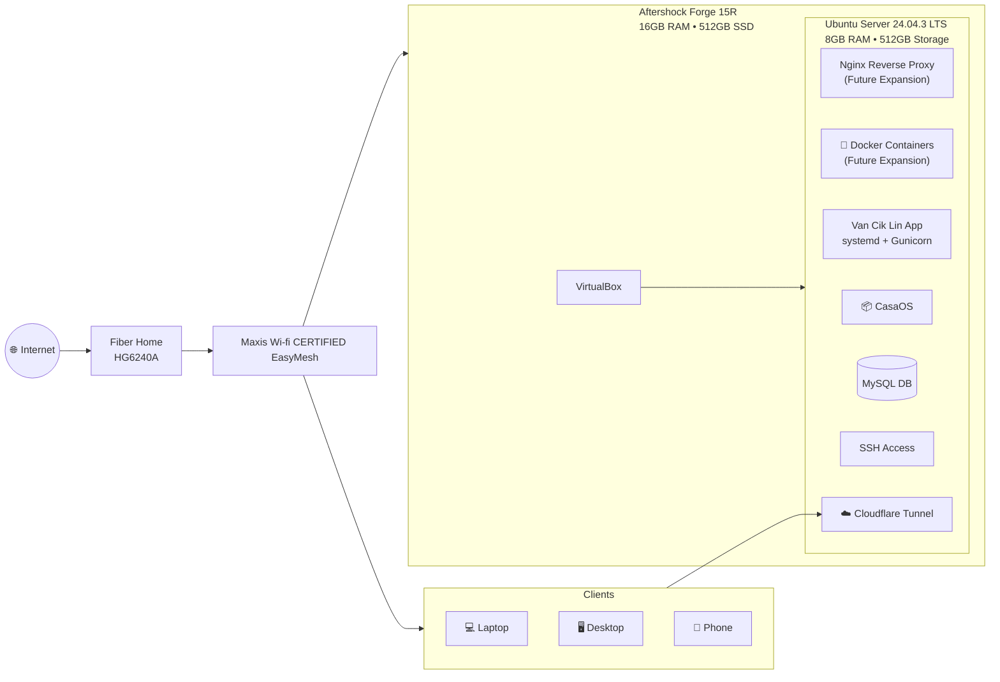

## Homelab Architechture Diagram

```mermaid

flowchart LR
 subgraph UbuntuVM["Ubuntu Server 24.04.3 LTS<br>8GB RAM • 512GB Storage"]
        Nginx["Nginx Reverse Proxy<br>(Future Expansion)"]
        Docker["🐳 Docker Containers<br>(Future Expansion)"]
        SystemD["Van Cik Lin App<br>systemd + Gunicorn"]
        CasaOS["📦 CasaOS"]
        MySQL[("MySQL DB")]
        SSH["SSH Access"]
        CloudflareTunnel["☁️ Cloudflare Tunnel"]
  end
 subgraph PhysicalHost["Aftershock Forge 15R<br>16GB RAM • 512GB SSD"]
        VirtualBox["VirtualBox"]
        UbuntuVM
  end
 subgraph ClientDevices["Clients"]
        LaptopClient["💻 Laptop"]
        DesktopClient["🖥️ Desktop"]
        PhoneClient["📱 Phone"]
  end
    Internet(("🌐 Internet")) --> Router["Fiber Home<br>HG6240A"]
    Router --> WifiMesh["Maxis Wi-fi CERTIFIED EasyMesh"]
    WifiMesh --> PhysicalHost
    WifiMesh --> ClientDevices
    VirtualBox --> UbuntuVM
    ClientDevices --> CloudflareTunnel

```

